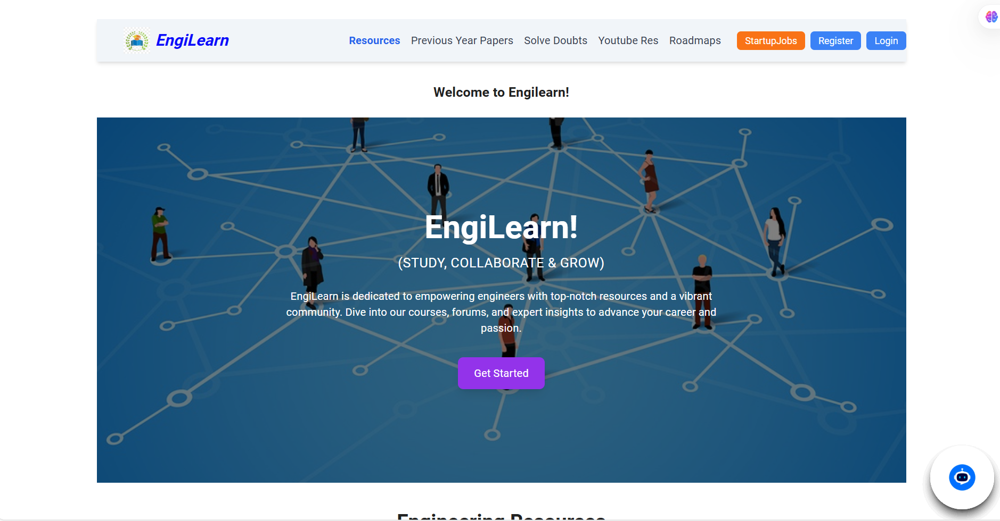
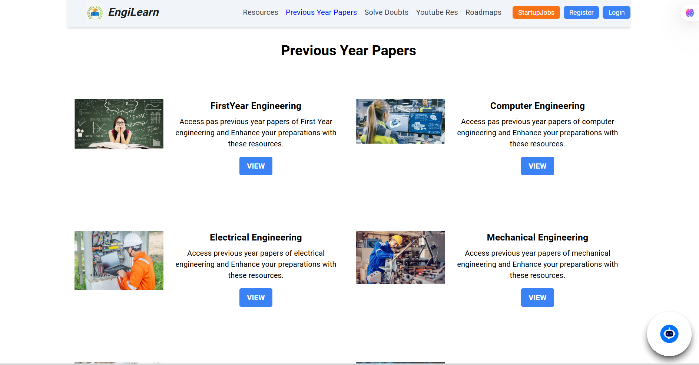
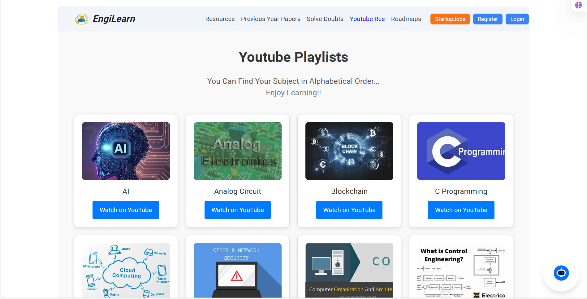
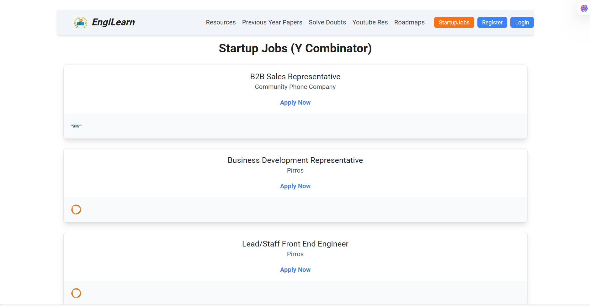
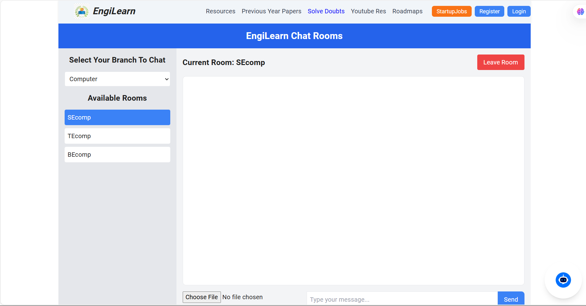

# 📘 EngiLearn — Full-Stack Educational Platform

**EngiLearn** is a full-stack platform built for engineering students to access subject notes, tutorials, and career resources. It includes real-time features, authentication, intelligent chatbot support, and a curated startup job board.

---

## 🚀 Tech Stack

### 🖥️ Frontend
- **React** + **Vite** – Fast and modern SPA
- **Tailwind CSS** – Utility-first styling
- **React Router** – Routing and navigation

### 🧠 Backend
- **Node.js** + **Express.js** – RESTful API server
- **MongoDB** – NoSQL database for storing user data, notes, and messages
- **Mongoose** – MongoDB object modeling
- **Zod** – Schema validation for clean input handling
- **JWT** – Secure user authentication

### ⚡ Real-time & AI
- **Socket.IO** – Real-time communication (e.g., Q&A, live help)
- **OpenAI API** – Chatbot to assist with learning queries
- **Startup Jobs API** – Curated list of opportunities for engineers

---

## 📸 Screenshots

### 🏠 Home Page  


### 📚 Subjects Papers  


### 🤖 YouTube Resources  


### 💼 Startup Jobs  


### ❓ Doubt Solving (Chatbot)  



---

## 🛠️ Getting Started

### Prerequisites

- Node.js (v14+)
- MongoDB (local or Atlas)
- OpenAI API key (for chatbot)

### Clone and Install

```bash
git clone https://github.com/VikasPrasad27/Engilearn-render.git
cd Engilearn-render
npm install
npx nodemon
cd Engilearn-render/client.engifrontend
npm install
npm run dev
```
## Environment variables
```bash
PORT=5000
MONGO_URI=your_mongo_uri
JWT_SECRET=your_jwt_secret
OPENAI_API_KEY=your_openai_key
```
### Folder Structure
---->client/engifrontend is frontend part 
---->other all are backend part, you add them in seperate folder naming server.

## Designed and Developed By: Vikas Prasad
